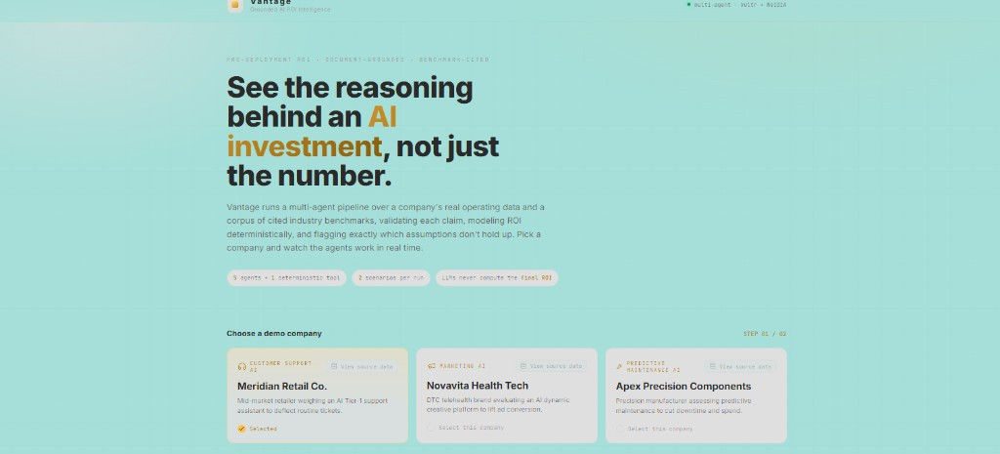
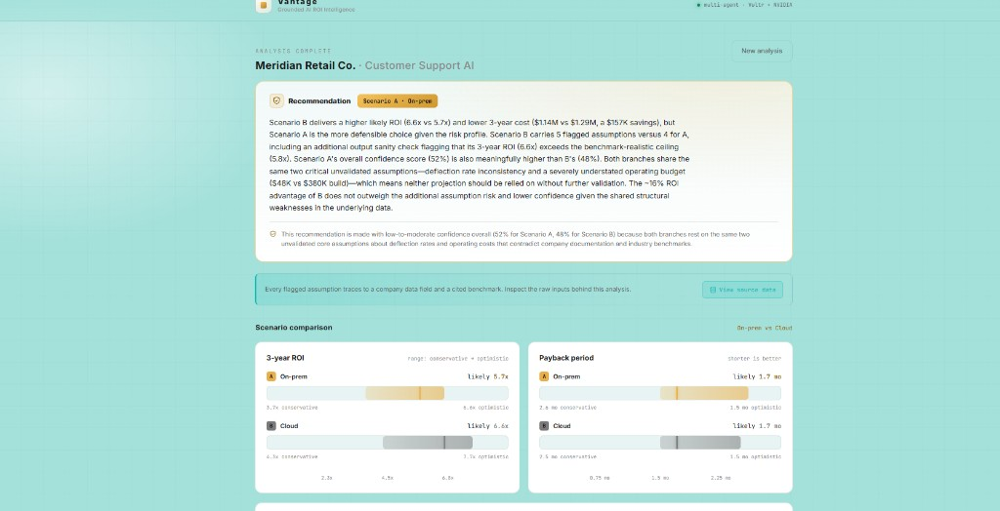

# Vantage

**Grounded AI ROI Intelligence** — a multi-agent system that predicts and *explains* the ROI of a proposed AI project, grounding every number in either the company's own operating data or a real, cited industry benchmark, and explicitly flagging the assumptions that don't hold up.

> Built for the RAISE Summit Hackathon 2026 (Vultr track).

---

## Screenshots

**Landing — pick a demo company and run a live analysis:**



**Analysis complete — LLM-reasoned recommendation and side-by-side scenario comparison:**



---

## Why

Enterprises spend heavily on AI but can rarely answer a simple question with confidence: *"How much will this project actually return if we build it?"* Only ~20% of organizations achieve the revenue growth they expect from AI (Deloitte), only ~6% are "high performers" who can attribute real bottom-line impact (McKinsey), and ~30% of GenAI projects are abandoned after proof-of-concept (Gartner).

Existing tools either measure ROI *after* deployment or are static pre-deployment calculators. **Vantage** is different: it's an agentic system that retrieves company data, cross-checks specific numeric claims against cited benchmarks with **visible reasoning**, and shows exactly which assumptions are unvalidated and why.

It's aimed at the analyst who has to build the business case for a mid-size enterprise with an existing operational baseline — not at replacing a consultancy, but at compressing the discovery-and-benchmarking stage from weeks to minutes, with the reasoning shown rather than hidden.

---

## How it works

One deterministic planning step, then three LLM-driven stages per scenario
branch, then a deterministic memo assembly — all through a single pipeline
implementation (`backend/pipeline/core.py`):

```
Company Profile
      │
      ▼
Branch construction ─ deterministic: 2 scenario branches for the
   category's unknown decision (e.g. on-prem vs cloud)
      │                                  (branches run in parallel)
      ▼
Retrieval (per branch)
   Internal retrieval (rerank) → Benchmark retrieval (rerank)
      → LLM claim validation (judges each claim against benchmark evidence;
        hallucinated citations structurally rejected)
      │
      ▼
Modeling Tool ─ deterministic Python: HTEC ROI formula, 3 scenarios
   (conservative / likely / optimistic), non-linear Y2+ cost scaling,
   output-level sanity check — locked by unit tests with hand-derived values
      │
      ▼
Explainability ─ breaks the projection down by ROI dimension with a
   confidence score per dimension (structured JSON tail + streamed prose)
      │
      ▼
Report ─ side-by-side "Scenario A vs Scenario B" memo + LLM-reasoned
   recommendation (cited confidence figures verified against real scores)
```

**Hard rule:** LLMs never compute the final ROI number. All arithmetic runs in plain, auditable, unit-tested Python.

> An earlier iteration used a Planner LLM for classification/branching; it was
> retired during remediation because branch construction is deterministic and
> the LLM added failure modes without adding decisions
> (see `docs/REMEDIATION_LOG.md`).

### Models

| Role | Model | Provider |
|---|---|---|
| Claim validation | `moonshotai/Kimi-K2.6` (fallback `MiniMaxAI/MiniMax-M2.7`) | Vultr Serverless Inference |
| Retrieval (rerank) | `vultr/VultronRetrieverCore-Qwen3.5-4.5B` | Vultr Serverless Inference |
| Explainability | `nvidia/nemotron-3-ultra-550b-a55b` (fallback `zai-org/GLM-5.2-FP8`) | NVIDIA build.nvidia.com (fallback Vultr) |
| Report recommendation | `MiniMaxAI/MiniMax-M2.7` (fallback `Kimi-K2.6`) | Vultr Serverless Inference |
| Branch planning / ROI math | none — deterministic Python | — |

---

## Supported categories

| Category | Benchmark facts | Demo company (fabricated) | Core value driver |
|---|---|---|---|
| Customer Support AI | 9 cited | Meridian Retail Co. | Ticket deflection × cost/ticket |
| Marketing AI | 11 cited | Novavita Health Tech | Conversion lift × traffic × AOV |
| Predictive Maintenance AI | 10 cited | Apex Precision Components | Maintenance spend reduction + avoided downtime |

Each demo company carries exactly one **intentionally-optimistic claim** (to test whether validation catches it) and one **intentionally-unknown field** (to test scenario branching).

---

## What makes it trustworthy

- **Claim validation reasons over evidence, not thresholds.** In testing it caught a company extrapolating a Tier-1-only deflection benchmark (68%) across *all* ticket types — a logical error a hardcoded rule could never catch.
- **Hard citation guard.** Any benchmark fact ID an LLM cites that wasn't actually shown to it is rejected — hallucinated citations are structurally impossible, not just discouraged.
- **Output-level sanity check.** Separate from input validation: even when inputs are clamped to realistic ranges, an implausible final ROI/payback (e.g. from an understated cost estimate) gets flagged. Ceilings are corpus-cited where a benchmark exists and explicitly labeled as modeling assumptions where none does.
- **Paraphrased, cited corpus.** Every benchmark fact is paraphrased (never copied) from named sources — McKinsey, Deloitte, Gartner, NVIDIA, IoT Analytics, Persistence Market Research, Siemens/Aberdeen, HTEC. Raw research is archived in `data/benchmarks/_research_raw/` for provenance.
- **View source data.** A read-only transparency viewer in the UI lets you inspect the raw synthetic company profile and the full benchmark corpus (with source tiers and citation types) behind any run — and jump from a flagged assumption straight to the exact source and data field.

---

## Project structure

```
.
├── backend/
│   ├── main.py               # FastAPI app (auth, rate limits, SSE — no pipeline logic)
│   ├── api/                  # request schemas, memo JSON builder, company registry
│   ├── agents/               # retrieval + claim validation, explainability, report
│   ├── modeling/             # deterministic ROI math + output sanity check
│   ├── pipeline/             # core.py (THE pipeline), claims.py, events.py, CLI runner
│   ├── llm/                  # Vultr / NVIDIA clients, rerank
│   ├── config/               # model names + per-agent token budgets
│   ├── tests/                # offline unit + regression tests (pytest)
│   └── evals/                # live model-behavior evals (capped, run manually/nightly)
├── frontend/                 # Next.js 14 app (analyst-console UI)
│   ├── app/                  # pages, layout, global styles
│   ├── components/           # agent trace, memo charts, confidence panels, source-data modal
│   └── lib/                  # API client, types, SSE hook, formatters
├── data/
│   ├── companies/            # synthetic company profiles
│   └── benchmarks/           # cited benchmark corpora (+ _research_raw/)
└── docs/                     # ARCHITECTURE.md, REMEDIATION_LOG.md, EVAL_LOG.md, ...
```

---

## Setup

### Prerequisites
- Python 3.10+
- Node.js 18+
- A **Vultr Serverless Inference** API key and an **NVIDIA build.nvidia.com** API key

### 1. Environment variables

Copy `.env.example` to `.env` in the repo root and fill in your keys:

```bash
cp .env.example .env
```

```
VULTR_API_KEY=your_vultr_serverless_inference_key_here
NVIDIA_API_KEY=your_nvidia_api_key_here
```

Optional hardening variables (recommended before deploying anywhere public —
see `.env.example` for the full list): `VANTAGE_API_TOKEN` (shared bearer
token required on run/signup endpoints; auth is off when unset),
`CORS_ORIGINS`, `VANTAGE_RUN_RATE_LIMIT`, `VANTAGE_SIGNUP_RATE_LIMIT`.

### 2. Backend

```bash
cd backend
python -m venv .venv
# Windows:  .venv\Scripts\activate
# macOS/Linux:  source .venv/bin/activate
pip install -r requirements.txt

python -m uvicorn main:app --host 127.0.0.1 --port 8001
```

The API is now on `http://127.0.0.1:8001`.

### 3. Frontend

```bash
cd frontend
npm install
npm run dev
```

Open `http://localhost:3000`. The frontend reads the backend base URL from `frontend/.env.local` (`NEXT_PUBLIC_API_BASE`, defaults to `http://127.0.0.1:8001`).

---

## Usage

### Web app
Pick one of the three demo companies, hit **Run live analysis**, and watch the agents work in real time — stage-by-stage trace, live claim verdicts (defensible / flagged), and token-by-token explainability. When the run completes you get a side-by-side scenario comparison (ROI ranges, payback, cost breakdown), a per-dimension confidence breakdown, and a **View source data** panel to verify every input.

**Your company:** switch to the *Your company* tab to run Vantage on real
numbers. Fill the category's intake form directly, or **upload a PDF/TXT
proposal** — an extraction agent pre-fills the form with every figure the
document states (never guessing missing ones), you review and complete it,
and the same validated pipeline runs both scenario branches on your data.
Extracted drafts never run unreviewed, and profiles are schema-validated
before any LLM call.

### CLI (no frontend needed)
Run any category end-to-end and print the full memo to the terminal:

```bash
cd backend
python pipeline/run_category.py customer_support   # or: marketing | maintenance
```

Output is also written to `backend/pipeline/last_memo_<category>.txt`.

---

## API

| Method | Endpoint | Purpose |
|---|---|---|
| `GET` | `/api/companies` | List the demo companies (id, name, category) |
| `POST` | `/api/run` | Run a category synchronously, return the full structured JSON memo |
| `GET` | `/api/run/stream` | Stream pipeline progress as Server-Sent Events (per-stage, per-branch) |
| `GET` | `/api/companies/{company_id}/source` | Raw company profile JSON (read-only transparency) |
| `GET` | `/api/benchmarks/{category_key}` | Full benchmark corpus JSON (read-only transparency) |
| `GET` | `/api/intake/fields` | Field specs for the custom-intake form |
| `POST` | `/api/extract-profile` | Upload a PDF/TXT → LLM-extracted draft profile (reviewed by the user before running) |
| `POST` | `/api/run/prepare` | Validate custom intake values, stage a one-time `run_id` |
| `GET` | `/api/run/stream?run_id=` | Stream a prepared custom run (single-use, 15-min TTL) |
| `POST` | `/api/early-access` | Early-access email signup |
| `GET` | `/health` | Health check |

`POST /api/run` accepts `{ "category": "customer_support", "company_id": "meridian-retail-support" }`
or an inline `company` JSON profile, which is schema-validated (422 on bad
input) **before** any LLM call. When `VANTAGE_API_TOKEN` is set, `/api/run`,
`/api/run/stream` (via `Authorization` header or `?token=`), and
`/api/early-access` require it; run endpoints are rate-limited per IP.

---

## Tests & evals

```bash
# Offline unit + regression tests (no provider calls; run in CI on every push)
python -m pytest backend/tests

# Lint
ruff check backend

# Live model-behavior evals (spends provider credits — capped, run manually/nightly)
cd backend
python -m evals.run --mock    # free harness smoke (CI)
python -m evals.run --live    # scored against real providers
```

The deterministic modeling core is locked by tests with independently
hand-derived expected values; the full pipeline has a golden regression per
category with providers mocked. Probabilistic LLM behavior (claim-validation
accuracy, citation discipline, explanation format compliance, recommendation
confidence integrity) is scored separately by the eval suite — results in
`docs/EVAL_LOG.md`.

---

## Known limitations

- Benchmark data is real and cited but mostly **secondary citations** (an article citing the primary McKinsey/Gartner report, not the report itself).
- No adoption / change-management-probability modeling — costs and benefits assume successful deployment.
- Retrieval is a single LLM validation call reasoning over claims *and* benchmark evidence together, not two agents debating in turns.
- The NVIDIA free-tier Explainability endpoint rate-limits under load; a tested Vultr GLM fallback exists but produces lower-quality prose and may skip the structured data tail (a legacy prose parse then applies).
- Predictive Maintenance's ROI sanity-check ceiling (5.0x) is a modeling assumption, not a corpus-cited figure — no published ROI-multiple benchmark exists for that category in the researched set.
- Branch construction is deterministic for all categories (the Planner-LLM path was retired during remediation — see `docs/REMEDIATION_LOG.md`).
- Inline company profiles are schema-validated and length-capped, but free-text fields still reach LLM prompts; treat verdict wording on untrusted profiles accordingly.

---

## Disclaimer

Vantage produces **grounded projections, not financial advice.** All company profiles included are **fabricated demo data** built to exercise the pipeline — not real companies. Benchmark figures are paraphrased from published sources and cited for reference.
